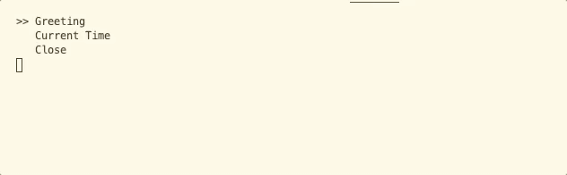
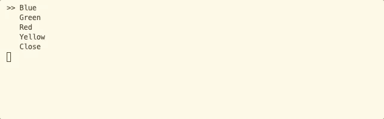
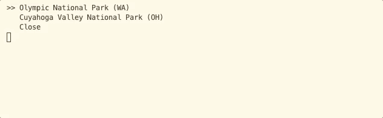
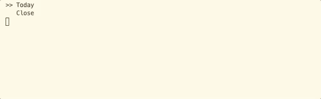
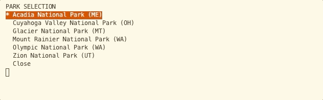

# README

This framework is a proof of concept at a lightweight, easy to implement, console menu framework. 

Out of the box, the menu supports:

* An easy to navigate menu
* An optional configuration framework
* Dynamic data-driven menu options
* Submenus


Two key design decisions were made putting the framework together:
* A fluent interface implemented using method chaining
* Delegates using Action and Action<T>

While these introduce concepts that students are unfamiliar to during the curriculum, they appear often in modern codebases and/or when using other frameworks (i.e. ASP.NET MVC)

## Usage

### Simple Menu

This example demonstrates the simplest use case for setting up a menu. Each menu option has text and a reference to a `void` method that is invoked.



**Code**

```csharp
static void Main(string[] args)
{    
    ConsoleMenu mainMenu = new ConsoleMenu()
        .AddOption("Greeting", ShowGreeting)
        .AddOption("Current Time", CurrentTime)
        .AddOption("Close", ConsoleMenu.Close);
    
    mainMenu.Show();
}

static void ShowGreeting()
{
    Console.WriteLine("Hello There!");
}

static void CurrentTime()
{
    Console.WriteLine($"The current date and time is {DateTime.Now}");
}
```

### Menu Callback Arguments

If an argument should be passed to the menu call back, a generic overload exists which supports passing an item that will be used when invoking the callback action.

This allows you to use the same callback to support data-driven menus.



```csharp
static void Main(string[] args)
{    
    ConsoleMenu mainMenu = new ConsoleMenu()
        .AddOption<string>("Blue", ColorSelection)
        .AddOption<string>("Green", ColorSelection)
        .AddOption<string>("Red", ColorSelection)
        .AddOption<string>("Yellow", ColorSelection)        
        .AddOption("Close", ConsoleMenu.Close);
        
    mainMenu.Show();
}

static void ColorSelection(string color)
{
    Console.WriteLine($"You selected {color}.");
}
```

The same result could be achieved by calling `AddOptionRange<T>` where `T` is the type of the parameter that will be passed to the callback method.

```csharp
static void Main(string[] args)
{
    List<string> colors = new List<string>()
    {
        "Blue",
        "Green",
        "Red",
        "Yellow"
    };

    ConsoleMenu mainMenu = new ConsoleMenu()
        .AddOptionRange<string>(colors, ColorSelection)
        .AddOption("Close", ConsoleMenu.Close);

    mainMenu.Show();
}
```

#### Working with Complex Types

More complex types can be passed in as well. Their `.ToString()` representation will be used when displayed as a menu option.



```csharp
static void Main(string[] args)
{
    List<Park> parks = new List<Park>()
    {
        new Park() { Name = "Olympic National Park", State = "WA" },
        new Park() { Name = "Cuyahoga Valley National Park", State = "OH" }
    };

    ConsoleMenu mainMenu = new ConsoleMenu()
        .AddOptionRange<Park>(parks, ParkSelection)
        .AddOption("Close", ConsoleMenu.Close);

    mainMenu.Show();    
}

static void ParkSelection(Park park)
{
    Console.WriteLine($"You selected {park.Name} which is located in {park.State}.");
}
```

### Sub Menu

A menu can be passed into an outer menu as a reference. In this example, the **Today** option invokes `.Show()` on the sub menu.



```csharp
static void Main(string[] args)
{    
    ConsoleMenu subMenu = new ConsoleMenu()
        .AddOption("Forecast", DisplayTodaysWeather)
        .AddOption("Date and Time", CurrentTime)
        .AddOption("Close", ConsoleMenu.Close);

    ConsoleMenu mainMenu = new ConsoleMenu()
        .AddOption("Today", subMenu.Show)
        .AddOption("Close", ConsoleMenu.Close);

    mainMenu.Show();
}
```

### Configuration

Each menu supports configuration with background and foreground colors, selectors, titles, and more.

The `.Configure()` method accepts a single argument, a `MenuConfig` that is used to modify the default configuration for each menu.




```csharp
static void Main(string[] args)
{
    
    ConsoleMenu mainMenu = new ConsoleMenu()
        .AddOptionRange<Park>(parks, ParkSelection)
        .AddOption("Close", ConsoleMenu.Close)
        .Configure(config => { 
            config.SelectedItemBackgroundColor = ConsoleColor.Red;
            config.SelectedItemForegroundColor = ConsoleColor.White;
            config.Selector = "* ";
            config.Title = "PARK SELECTION";
        });

    mainMenu.Show();
}
```

